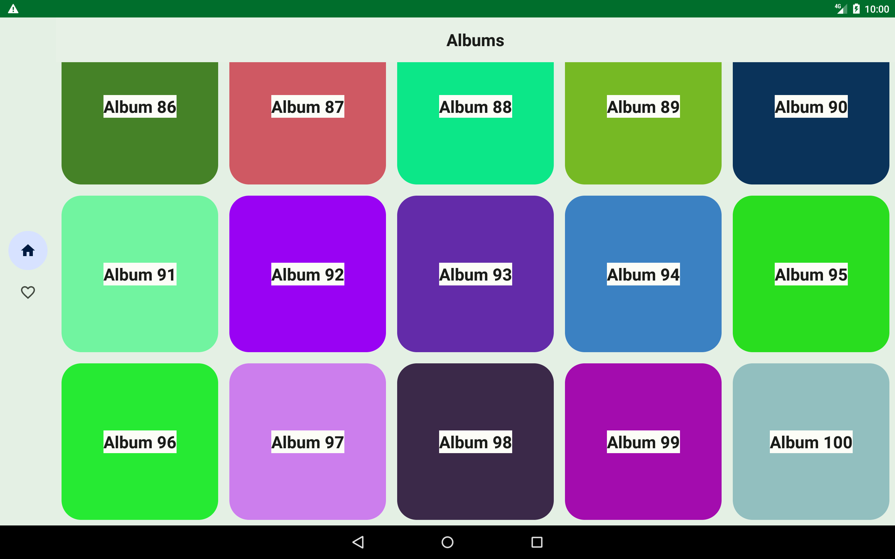
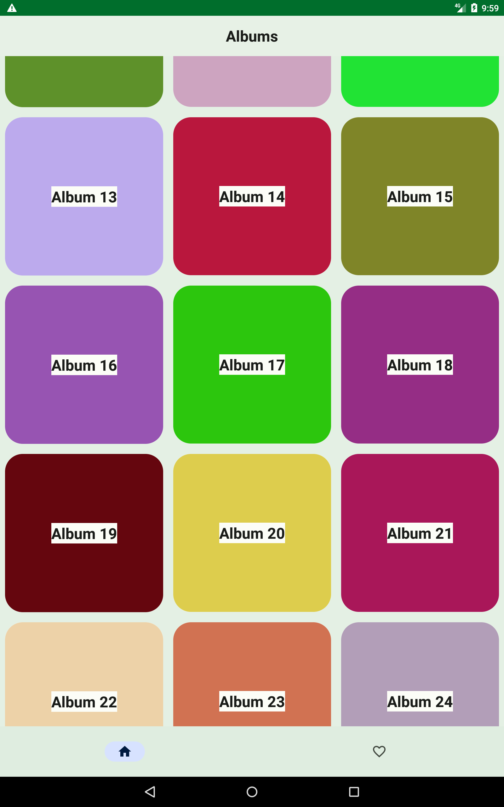
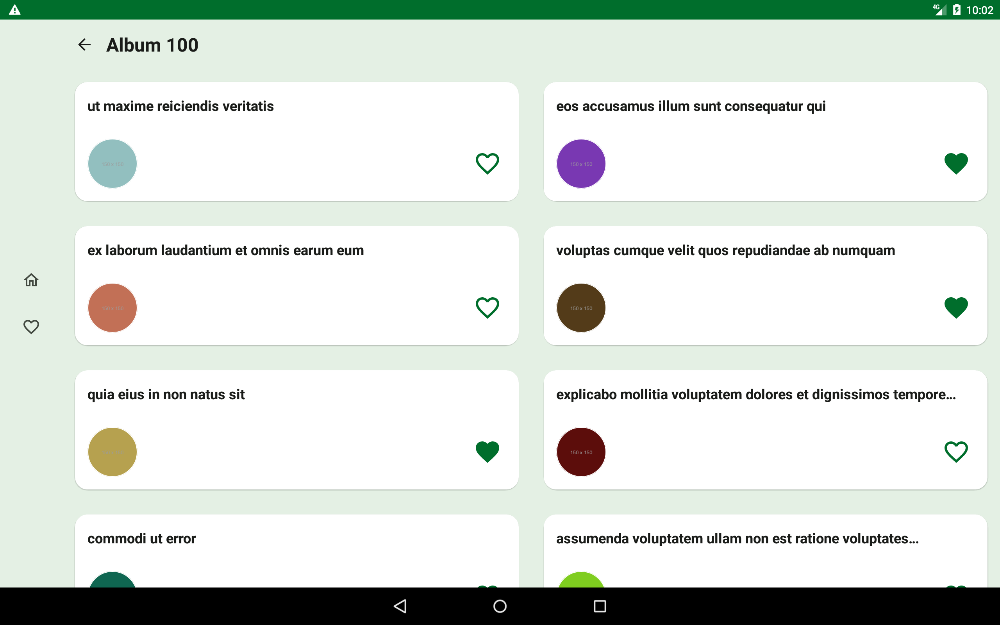
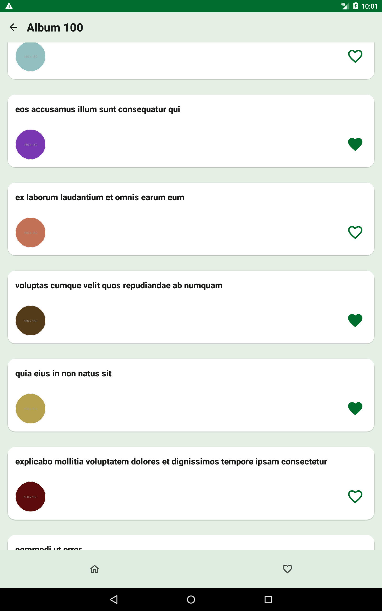
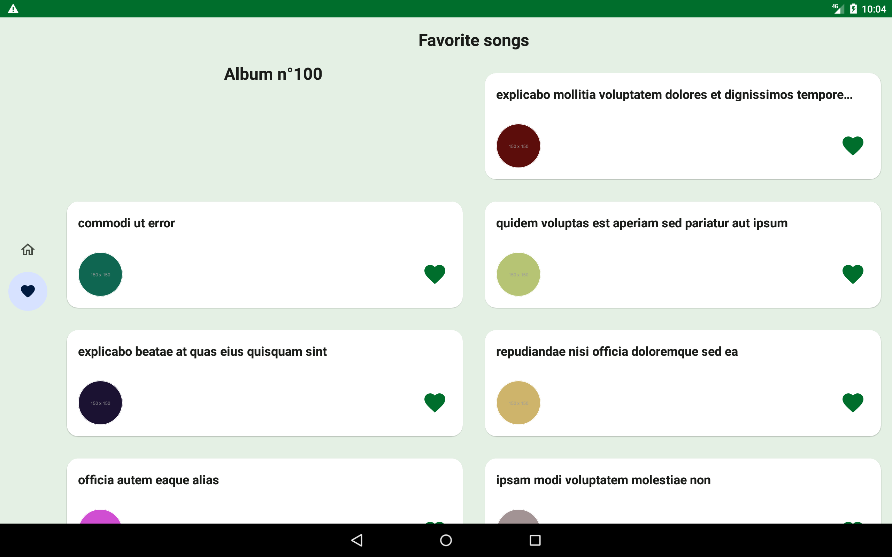
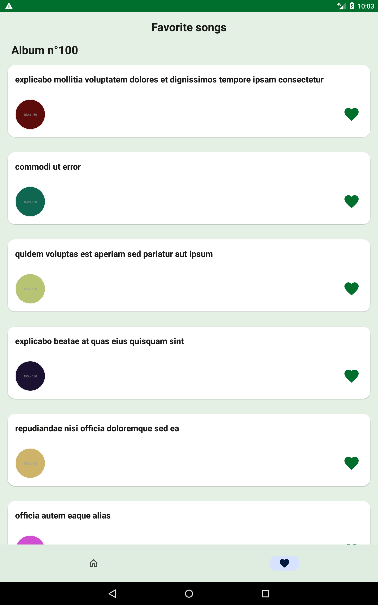
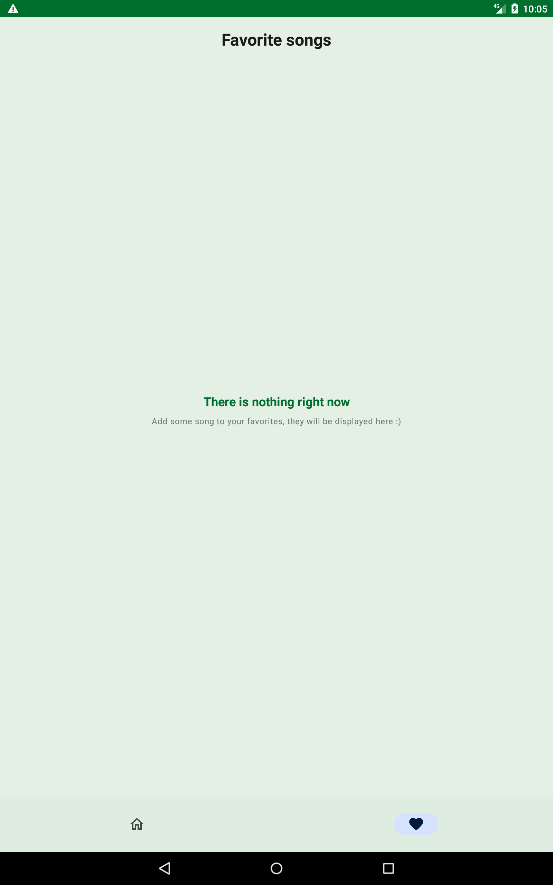
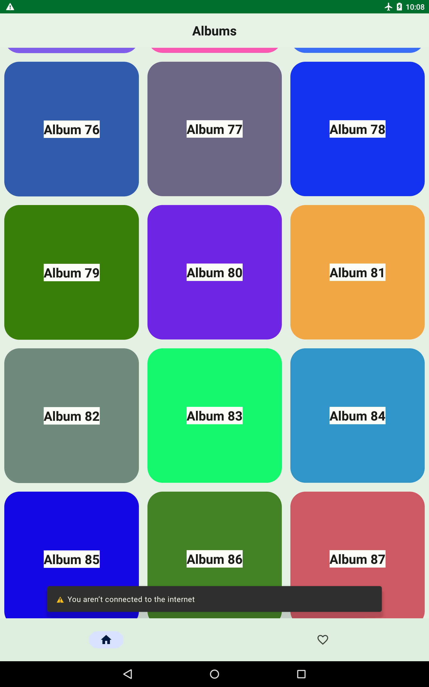
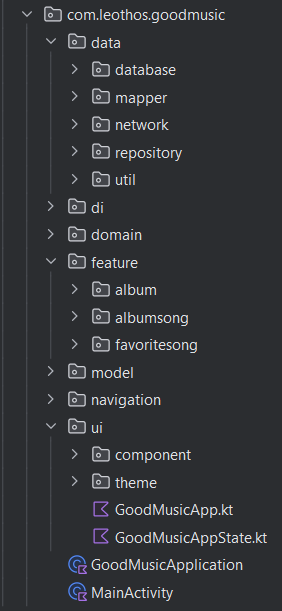

# GoodMusic

GoodMusic is a technical test app, built with Kotlin,
[Jetpack Compose](https://developer.android.com/jetpack/compose).

The main goal of this test is to show albums fetched
with [Retrofit](https://square.github.io/retrofit/)
and to display the song lists associated.

All data are stored
with [Room database](https://developer.android.com/jetpack/androidx/releases/room) to allow an
offline mode.

It is also possible to put songs into favorite and to retrieve them.

## Screenshots

## Features

* offline mode
* Album visualisation
* Song visualisation by album or by favorites
* graph navigation with bottom navigation or nav rail
* material3 theming (colorScheme, typography...)
* Adaptive UI with WindowSize class
* splashscreen (upper versions)

### Screens

This app contains three screens:

- List of albums -> package [`com.leothos.goodmusic.feature.album`]
- List of songs for each albums -> package [`com.leothos.goodmusic.feature.albumsong`]
- List of favorite songs -> package [`com.leothos.goodmusic.feature.favoritesong`]

### Architecture

MVVM + Clean Architecture
+ dependency injection
  with [Hilt](https://developer.android.com/training/dependency-injection/hilt-android)

  

### Ui Test and unit test

- package [`com.leothos.goodmusic.androidTest`]
- package [`com.leothos.goodmusic.test`]

